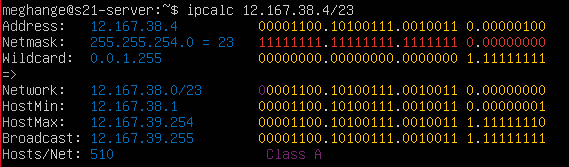
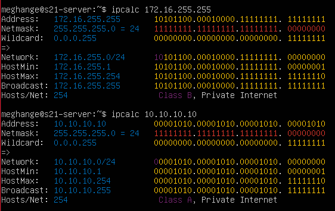
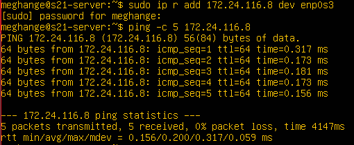
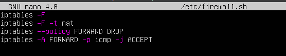

# Linux Network

## Part 1. Инструмент ipcalc

**1.1. Сети и маски**

1) Адрес сети *192.167.38.54/13*

`ipcalc 192.167.38.54/13` - Эта команда вернет вам адрес сети, который является результатом применения маски подсети к указанному IP-адресу.

Aдрес сети для `192.167.38.54/13` составляет `192.160.0.0`.

2) Перевод маски *255.255.255.0* в префиксную и двоичную запись, */15* в обычную и двоичную, *11111111.11111111.11111111.11110000* в обычную и префиксную

- 255.255.255.0 в двоичной записи равна 11111111.11111111.11111111.00000000
- 255.255.255.0 префиксная запись /24
- /15 в двоичной записи равна 11111111.00000000В
- /15 обычная запись 255.0.0.0
- *11111111.11111111.11111111.11110000* обычная запись 255.255.255.224
- *11111111.11111111.11111111.11110000*  префиксная запись /27

3) Минимальный и максимальный хост в сети *12.167.38.4* при масках: */8*, *11111111.11111111.00000000.00000000*, *255.255.254.0* и */4*

`ipcalc 12.167.38.4/8`

HostMin: 12.0.0.1 - это минимальный хост в сети. 

HostMax: максимальный хост — 12.255.255.254.

Маска 11111111.11111111.00000000.00000000: Переводом в префиксную запись получаем /16 `ipcalc 12.167.38.4/16`

Таким образом, минимальным хостом в сети 12.167.38.4 с маской 11111111.11111111.00000000.00000000 является 12.167.0.1, а максимальным хостом — 12.167.255.254. 

Маска 255.255.254.0: Переводом в префиксную запись получаем /23 `ipcalc 12.167.38.4/23`

Таким образом, минимальным хостом в сети 12.167.38.4 с маской 255.255.254.0 является 12.167.38.1, а максимальным хостом — 12.167.39.254.

Маска /4: `ipcalc 12.167.38.4/4`

Таким образом, минимальным хостом в сети 12.167.38.4 с маской /4 является 0.0.0.1, а максимальным хостом — 15.255.255.254.

**1.2. localhost**

Определи и запиши в отчёт, можно ли обратиться к приложению, работающему на localhost, со следующими IP: *194.34.23.100*, *127.0.0.2*, *127.1.0.1*, *128.0.0.1*

*194.34.23.100 - чаный*

*127.0.0.2 - публичный*

 *127.1.0.1 - публичный*

*128.0.0.1 - часный*

Таким образом, можно обратиться к приложению, работающему на localhost, со следующими IP: 127.0.0.2, 127.1.0.1

**1.3. Диапазоны и сегменты сетей**

Определи и запиши в отчёт:

1) Какие из перечисленных IP можно использовать в качестве публичного, а какие только в качестве частных: *10.0.0.45*, *134.43.0.2*, *192.168.4.2*, *172.20.250.4*, *172.0.2.1*, *192.172.0.1*, *172.68.0.2*, *172.16.255.255*, *10.10.10.10*, *192.169.168.1*

• приватные: 10.0.0.45 192.168.4.2 172.20.250.4 172.16.255.255 10.10.10.10

• публичные: 134.43.0.2 172.0.2.1 192.172.0.1 172.68.0.2 192.169.168.1

2) Какие из перечисленных IP-адресов шлюза возможны у сети *10.10.0.0/18*: *10.0.0.1*, *10.10.0.2*, *10.10.10.10*, *10.10.100.1*, *10.10.1.255*

Сеть 10.10.0.0/18 охватывает адреса от 10.10.0.1 до 10.10.63.254. Исходя из этого, возможными адресами шлюза являются: 10.10.0.2 10.10.10.10 10.10.1.255 Адреса 10.0.0.1 и 10.10.100.1 находятся вне диапазона этой подсети и не могут быть использованы в качестве адреса шлюза для сети 10.10.0.0/18.

## Part 2. Статическая маршрутизация между двумя машинами

Создадим виртуальную машину ws2. 

С помощью команды ip a посмотрим существующие сетевые интерфейсы обеих машин.

Сетевой интерфейс, соответствующий внутренней сети, на обеих машинах: ip link

Опиши сетевой интерфейс, соответствующий внутренней сети, на обеих машинах и задай следующие адреса и маски: ws1 — *192.168.100.10*, маска */16*, ws2 — *172.24.116.8*, маска */12*.

Адресс ws1 192.168.100.10 маска /16

**2.1. Добавление статического маршрута вручную**

Добавь статический маршрут от одной машины до другой и обратно при помощи команды вида `ip r add`.

Пропингуй соединение между машинами.

`ws1: sudo ip r add 172.24.116.8 dev enp0s3`

`ping -c 5 172.24.116.8`

Добавили статический маршрут от ws1 до ws2 при помощи команды вида `ip r add`. Пропинговали соединение между машинами. 

Добавили статический маршрут от ws2 до ws1 при помощи команды вида `ip r add`. Пропинговали соединение между машинами. 

**2.2. Добавление статического маршрута с сохранением**

Перезапусти машины.

Добавь статический маршрут от одной машины до другой с помощью файла `*/etc/netplan/00-installer-config.yaml*.`

- `sudo nano /etc/netplan/00-installer-config.yaml` – открытие файла
- внесение изменений (обавление статического маршрута)
- `sudo netplan apply` – применение изменений

Пропингуй соединение между машинами. Для ws1: `ping -c 5 172.24.116.8`

Для ws2: `ping -c 5 192.168.100.10`

## Part 3. Утилита **iperf3**

**3.1. Скорость соединения**

Переведи и запиши в отчёт: 8 Mbps в MB/s, 100 MB/s в Kbps, 1 Gbps в Mbps.

8 Mbps = 1 MB/s

100 MB/s = 800000 kbps

1 Gbps = 1000 Mbps

**3.2. Утилита iperf3**

Измерь скорость соединения между ws1 и ws2.

 iperf3 на ws1 запускается в режиме сервера с помощью команды: iperf3 -s

Измерена скорость соединения между машинами ws1 и ws2(видна на скриншоте)

## Part 4. Сетевой экран

Создай файл `*/etc/firewall.sh*`, имитирующий файрвол, на ws1 и ws2:

ws1 #!/bin/sh Удаление всех правил в таблице «filter» (по-умолчанию). iptables -F iptables -X

ws2 #!/bin/sh Удаление всех правил в таблице «filter» (по-умолчанию). iptables -F iptables -X

Нужно добавить в файл подряд следующие правила:

1. На ws1 примени стратегию, когда в начале пишется запрещающее правило, а в конце пишется разрешающее правило (это касается пунктов 4 и 5).
2. На ws2 примени стратегию, когда в начале пишется разрешающее правило, а в конце пишется запрещающее правило (это касается пунктов 4 и 5).
3. Открой на машинах доступ для порта 22 (ssh) и порта 80 (http).
4. Запрети echo reply (машина не должна «пинговаться», т.е. должна быть блокировка на OUTPUT).
5. Разреши echo reply (машина должна «пинговаться»). В отчёт помести скрины с содержанием файла /etc/firewall для каждой машины.

Правила для ws1

Правила для ws2

Запусти файлы на обеих машинах командами `s`u

Запуск файла на ws1

Запуск файла на ws2

Разница между стратегиями, применёнными в первом и втором файлах.

Основное отличие заключается в порядке применения правил: на ws1 сначала применяются запрещающие правила, а затем разрешающие, в то время как на ws2 сначала применяются разрешающие правила, а затем запрещающие. Это влияет на то, какие пакеты будут пропущены или заблокированы в зависимости от порядка правил. Для машины ws1 первой стоит команда отклонить пакет. Будет выполнятся этот запрет и пинг не пройдет. Для машины ws2 напротив, первым стоит разрешить прохождение пакета. Пинг проходит.

## 4.2. Утилита **nmap**

Командой **ping** найди машину, которая не «пингуется», после чего утилитой **nmap** покажи, что хост машины запущен.

ws1 не пингуется из-за [firewall.sh](http://firewall.sh/)

apache2 DHSP server isc-dhcp-services

Подними пять виртуальных машин (3 рабочие станции (ws11, ws21, ws22) и 2 роутера (r1, r2)).

**5.1. Настройка адресов машин**

В настройках Virtualbox меняем типы соединения: ws11, ws21, ws21: Адаптер 1 - NAT Адаптер 2 - Внутренняя сеть

r1, r2: Адаптер1 - NAT Адаптер 2 - Внутренняя сеть Адаптер 3 - Внутренняя сеть

Настрой конфигурации машин в *etc/netplan/00-installer-config.yaml* согласно сети на рисунке.

`sudo nano /etc/netplan/00-installer-config.yaml` внесем необходимые изменения

настройка r2

network: начинает блок конфигурации сети. version: 2 указывает версию схемы Netplan. ethernets: начинает блок определения настроек Ethernet интерфейсов. eth0s3: eth0s8: eth0s9 обозначают идентификаторы интерфейсов. Эти идентификаторы могут отличаться в зависимости от конкретной конфигурации системы и оборудования. dhcp4: false отключает получение настроек через DHCP для интерфейса. addresses: определяет статические IP-адреса для интерфейса.

настройка r1

настройка ws11

настройка ws21

настройка ws22

Перезапусти сервис сети. Если ошибок нет, командой `ip -4 a` проверь, что адрес машины задан верно. Также пропингуй ws22 с ws21. Аналогично пропингуй r1 с ws11.

ws11

ws21

ws22

r1

r2

Также пропингуй ws22 с ws21. Аналогично пропингуй r1 с ws11.

ws22 с ws21

r1 с ws11

**5.2. Включение переадресации IP-адресов**

Для включения переадресации IP выполни команду на роутерах:

`sysctl -w net.ipv4.ip_forward=1`При таком подходе переадресация не будет работать после перезагрузки системы.

r1

r2

Открой файл */etc/sysctl.conf* и добавь в него следующую строку:  `net.ipv4.ip_forward = 1`

При использовании этого подхода, IP-переадресация включена на постоянной основе.

r1

r2

**5.3. Установка маршрута по-умолчанию**

Пример вывода команды `ip r` после добавления шлюза: default via 10.10.0.1 dev eth0 10.10.0.0/18 dev eth0 proto kernel scope link src 10.10.0.2 Настрой маршрут по-умолчанию (шлюз) для рабочих станций. Для этого добавь default перед IP роутера в файле конфигураций. В отчёт помести скрин с содержанием файла etc/netplan/00-installer-config.yaml;

Откроем на машинах ws11, ws21, ws22 файл конфигурации командой: sudo nano /etc/netplan/00-installer-config.yaml и внесем необходимые изменения.

Добавление шлюза для ws11

Добавление шлюза для ws21

Добавление шлюза для ws22

Вызови ip r и покажи, что добавился маршрут в таблицу маршрутизации. 

ws11

ws21

ws22

Пропингуй с ws11 роутер r2 и покажи на r2, что пинг доходит. Для этого используй команду: tcpdump -tn -i eth0

Таким образом, пинг с ws11 доходит до r2, но поскольку роутеру неизвестно, куда возвращать пакеты, они не возвращаются назад, о чем сообщает результаты команды "0 received, 100% lost”

**5.4. Добавление статических маршрутов**

Добавь в роутеры r1 и r2 статические маршруты в файле конфигураций. Пример для r1 маршрута в сетку 10.20.0.0/26: Добавь в конец описания сетевого интерфейса eth1:

- to: 10.20.0.0 via: 10.100.0.12

Вызови ip r и покажи таблицы с маршрутами на обоих роутерах. Пример таблицы на r1: 10.100.0.0/16 dev eth1 proto kernel scope link src 10.100.0.11 10.20.0.0/26 via 10.100.0.12 dev eth1 10.10.0.0/18 dev eth0 proto kernel scope link src 10.10.0.1

Запусти команды на ws11: ip r list 10.10.0.0/[маска сети] и ip r list 0.0.0.0/0 В отчёт помести скрин с вызовом и выводом использованных команд;

- Результаты команды ip r list 10.10.0.0/18 10.10.0.0/18 dev enp0s8 proto kernel scope link src 10.10.0.2: Эта запись указывает, что пакеты, направленные в подсеть 10.10.0.0/18, будут отправлены через интерфейс enp0s8. Протокол kernel означает, что маршрут был добавлен ядром системы. Scope link указывает на то, что маршрут действителен только для устройств в той же локальной сети. Src 10.10.0.2 показывает исходный IP-адрес пакетов, отправляемых через этот маршрут.
- Результаты команды ip r list 0.0.0.0/0 default via 10.10.0.1 dev enp0s8 proto static: Это маршрут по умолчанию через шлюз 10.10.0.1 на интерфейсе enp0s8. Протокол static указывает на то, что маршрут был добавлен статически. default via 10.0.2.2 dev enp0s3 proto dhcp src 10.0.2.15 metric 100: Это альтернативный маршрут по умолчанию через шлюз 10.0.2.2 на интерфейсе enp0s3, полученный через DHCP. Src 10.0.2.15 — исходный IP-адрес для пакетов, отправляемых через этот маршрут. Metric 100 указывает на приоритет этого маршрута по сравнению с другими.

В отчёте объясни, почему для адреса 10.10.0.0/[маска сети] был выбран маршрут, отличный от 0.0.0.0/0, хотя он попадает под маршрут по-умолчанию.

- Маршрут для адреса 10.10.0.0/18 выбран, потому что он более специфичен для данного диапазона IP-адресов, чем маршрут по умолчанию 0.0.0.0/0. В сетевых настройках предпочтение отдается более конкретным маршрутам. Таким образом, пакеты, адресованные в подсеть 10.10.0.0/18, будут следовать этому маршруту, а не маршруту по умолчанию, поскольку он точнее соответствует их назначению.

**5.5. Построение списка маршрутизаторов**

Пример вывода утилиты traceroute после добавления шлюза: 1 10.10.0.1 0 ms 1 ms 0 ms 2 10.100.0.12 1 ms 0 ms 1 ms 3 10.20.0.10 12 ms 1 ms 3 ms Запусти на r1 команду дампа: tcpdump -tnv -i eth0

При помощи утилиты traceroute построй список маршрутизаторов на пути от ws11 до ws21.

В отчёте, опираясь на вывод, полученный из дампа на r1, объясни принцип работы построения пути при помощи traceroute. Из дампа на r1 видно, что пакет проходит через маршрутизаторы для достижения указанного адреса. На этом основан принцип работы traceroute.

- Каждый пакет проходит на своем пути определенное количество узлов, пока достигнет своей цели. Причем, каждый пакет имеет свое время жизни. Это количество узлов, которые может пройти пакет перед тем, как он будет уничтожен. Этот параметр записывается в заголовке TTL, каждый маршрутизатор, через который будет проходить пакет уменьшает его на единицу. При TTL=0 пакет уничтожается, а отправителю отсылается сообщение Time Exceeded. Команда traceroute linux использует UDP пакеты. Она отправляет пакет с TTL=1 и смотрит адрес ответившего узла, дальше TTL=2, TTL=3 и так пока не достигнет цели. Каждый раз отправляется по три пакета и для каждого из них измеряется время прохождения. Пакет отправляется на случайный порт, который, скорее всего, не занят. Когда утилита traceroute получает сообщение от целевого узла о том, что порт недоступен трассировка считается завершенной.

**5.6. Использование протокола ICMP при маршрутизации**

Запусти на r1 перехват сетевого трафика, проходящего через eth0 с помощью команды: tcpdump -n -i eth0 icmp

## **Part 6. Динамическая настройка IP с помощью DHCP**

Для r2 настрой в файле */etc/dhcp/dhcpd.conf* конфигурацию службы **DHCP**:

1) Укажи адрес маршрутизатора по умолчанию, DNS-сервер и адрес внутренней сети. Пример файла для r2:subnet 10.100.0.0 netmask 255.255.0.0 {} subnet 10.20.0.0 netmask 255.255.255.192 { range 10.20.0.2 10.20.0.50; option routers 10.20.0.1; option domain-name-servers 10.20.0.1; } Для работы с протоколом DHCP сначала надо установить sudo apt-get install isc-dhcp-server на r2 На r2 открыть для настройки конфигурации службы DHCP файл командой sudo nano /etc/dhcp/dhcpd.conf и внести необходимые изменения

2. В файле resolv.conf пропиши nameserver 8.8.8.8.

Перезагрузи службу DHCP командой systemctl restart isc-dhcp-server. Машину ws21 перезагрузи при помощи reboot и через ip a покажи, что она получила адрес. Также пропингуй ws22 с ws21.

Так как в сети появился DHCP-сервер, в файле конфигурации etc/netplan/00-installer-config.yaml изменим dhcp4: true

команды ip a. ws21 получила динамический ip адрес 

Пинги успешно проходят. 

Укажи MAC-адрес у ws11, для этого в *etc/netplan/00-installer-config.yaml* надо добавить строки: `macaddress: 10:10:10:10:10:BA`, `dhcp4: true`.

В etc/netplan/00-installer-config.yaml
добавлены строки macaddress‘а, а так же dhcp4: true

Для r1 настрой аналогично r2, но сделай выдачу адресов с жесткой привязкой к MAC-адресу (ws11). Проведи аналогичные тесты.

Проведена настройка r2. Сделана статическая привязка к mac адресу

Изменен dns в `resolf.conf`

Произвден рестарт DHCP

Произвден `reboot` ws11

в `ip a` указан необходимый mac address

**Запроси с ws21 обновление IP-адреса.**

• ip адрес до запроса

• Новый ip адрес после запроса.

**Сохрани дампы образов виртуальных машин.**

Дампы машин успешно созданы.

## Part 7. **NAT**

В файле */etc/apache2/ports.conf* на ws22 и r1 измени строку `Listen 80` на `Listen 0.0.0.0:80`, то есть сделай сервер Apache2 общедоступным.

Измененное содержание файла на r1

Измененное содержание файла на ws22

Запусти веб-сервер Apache командой `service apache2 start` на ws22 и r1

Использование `service apache2 start` на r1. Статус сервера Apache.

Использование `service apache2 start` на ws22. Статус сервера Apache.

**Добавь в фаервол, созданный по аналогии с фаерволом из Части 4, на r2 следующие правила:**

1) Удаление правил в таблице filter — `iptables -F`;

2) Удаление правил в таблице «NAT» — `iptables -F -t nat`;

3) Отбрасывать все маршрутизируемые пакеты — `iptables --policy FORWARD DROP`.

На r2 в файлв `/etc/firewal.sh`добавлены необходимые записи.

Запусти файл также, как в Части 4.

Запуск фаервола на r2.

**Добавь в файл ещё одно правило:**

*Разрешить маршрутизацию всех пакетов протокола ICMP.*

Добавлено новое правило для маршрутизации всех пакетов по ICMP

Запуск фаервола на r2.

**Проверь соединение между ws22 и r1 командой `ping.`**

пинг не проходит 

**Добавь в файл ещё два правила:**

*Включи SNAT, а именно маскирование всех локальных IPиз локальной сети, находящейся за r2 (по обозначениям из Части 5 — сеть 10.20.0.0).*

> Добавим строку: iptables -t nat -A POSTROUTING -s 10.20.0.0/26 -o eth1 -j SNAT —to-source 10.100.0.12, которая заменяет исходный IP-адрес пакета, выходящего через eth1, маскируя его под пакеты сети 10.20.0.0/26
> 

*Включи DNAT на 8080 порт машины r2 и добавить к веб-серверу Apache, запущенному на ws22, доступ извне сети.*

Изменный файл с правилами из пунктов 5-6.

**Запусти файл также, как в Части 4. Перед тестированием рекомендуется отключить сетевой интерфейс NAT (его наличие можно проверить командой ip a) в VirtualBox, если он включен.**

Файл был успешно запущен

**Проверь соединение по TCP для SNAT: для этого с ws22 подключиться к серверу Apache на r1 командой: `telnet [адрес] [порт]`**

Подключение с ws22 прошло успешно.

**Проверь соединение по TCP для DNAT: для этого с r1 подключиться к серверу Apache на ws22 командой telnet (обращаться по адресу r2 и порту 8080).**

Подключение с r1 прошло успешно

Дампы машины были сохранены

## Part 8. Дополнительно. Знакомство с **SSH Tunnels**

В данном задании используются виртуальные машины из Части 5.

**Запусти на r2 фаервол с правилами из Части 7.**

Запущен фаервол с правилами из part 7.

**Запусти веб-сервер Apache на ws22 только на localhost (то есть в файле /etc/apache2/ports.conf измени строку Listen 80 на Listen localhost:80).**

Изменена строка в /etc/apache2/ports.conf на Listen localhost:80

Запуск и проверка статуса сервера apache2.

**Воспользуйся *Local TCP forwarding* с ws21 до ws22, чтобы получить доступ к веб-серверу на ws22 с ws21.**

 Ввод команды ssh -L 8080:localhost:80 10.20.0.20 с машины ws21 на ws22

 ws21 успешно подключилась к ws22

команда проверки туннеля между ws21 и ws22

**Для проверки, сработало ли подключение в обоих предыдущих пунктах, перейди во второй терминал (например, клавишами Alt + F2) и выполни команду: `telnet 127.0.0.1 [локальный порт]`**

**Воспользуйся Remote TCP forwarding c ws11 до ws22, чтобы получить доступ к веб-серверу на ws22 с ws11.**

ws22 также успешно подключилась к ws11

**Сохрани дампы образов виртуальных машин.**
